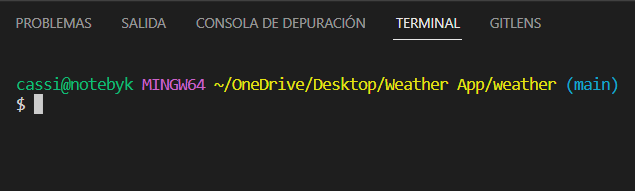

# ¡Bienvenidos a mi Weather App!

En esta aplicación podemos buscar el clima en tiempo real de las distintas ciudades del mundo.

Esta es la página de inicio

## Deploy
En este link puedes interactuar con la SPA (Single Page Application): https://byk-weather-app.vercel.app/

## Local
Para correr la aplicación de forma local debes seguir los siguientes pasos:

- Descargar el código del repositorio; en la parte superior del repo encontrarás un botón que dice código/code dependiendo del idioma, le das click y se despliegan unas opciones, selecionamos Descargar ZIP/Download ZIP.

- Descomprimir la carpeta y abrir con tu editor de código favorito.
- Hacer `npm install` en la terminal. Esto nos va a descargar todos los paquetes necesarios para nuestra aplicación.
- Hacer `npm start`. Esto nos llevará al navegador donde podremos ver la aplicación.

Recuerda estar posicionado sobre la carpeta del proyecto, en este caso debe terminar en /weather

